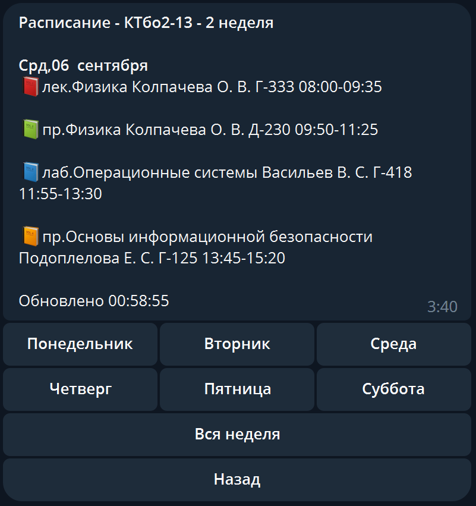

# Расписание ИКТИБ в телеграм боте


## Системные требования
NodeJS 16+
512+ GB RAM 
1+ CPU core

## Развёртывание приложения

Откройте консоль, введите следующие команды:
  ```git clone https://github.com/dhjwst/ictis-schedule.git```
  ```cd ictis-schedule```
  После найдите файл `env_example`, переименуйте в `.env`. Откройте его, замените строку `телеграм токен` на токен вашего телеграм бота.
  Далее введите следующие команды:
  ```npm install```
  ```node index```
  Готово!
